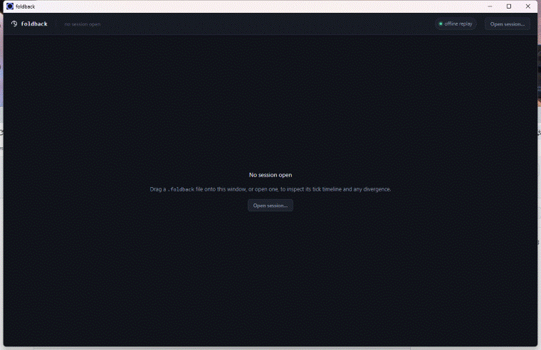

# Foldback

*The UI opening a real `.foldback` file recorded by `examples/ggrs-demo` (an actual GGRS rollback session with an injected desync) — scrubbing from a clean tick to the exact tick it diverged. UI-only for now; a fuller demo showing the simulation itself running is future work.*

A desync/divergence debugger for lockstep/rollback multiplayer games: hash simulation state on a schedule, compare hashes across peers, and bisect down to the tick and (with opt-in field hashing) the field where two clients' simulations diverged.

Status: Phase 0 (core + CLI) and Phase 1 (UI v1) done; Phase 2 underway. `foldback-core` (hashing, session file format, Level 1/2/3 bisection, a live-mode WebSocket server), `foldback-cli` (`analyze`, `ci-check`), and `foldback-ui` (a Tauri desktop app — open or drag a `.foldback` file, or connect live to a running game) are implemented and tested, with `examples/ggrs-demo` and `examples/live-demo` proving the offline and live chains against real GGRS and live-streamed sessions. No engine binding beyond raw Rust and GGRS yet.

Docs: **[felixmiddelhoff.github.io/foldback](https://felixmiddelhoff.github.io/foldback/)** — start with [Quickstart](https://felixmiddelhoff.github.io/foldback/getting-started/quickstart.html).

## License

Licensed under either of

* Apache License, Version 2.0 ([LICENSE-APACHE](LICENSE-APACHE) or http://www.apache.org/licenses/LICENSE-2.0)
* MIT license ([LICENSE-MIT](LICENSE-MIT) or http://opensource.org/licenses/MIT)

at your option.

### Contribution

Unless you explicitly state otherwise, any contribution intentionally submitted for inclusion in the work by you, as defined in the Apache-2.0 license, shall be dual licensed as above, without any additional terms or conditions.
